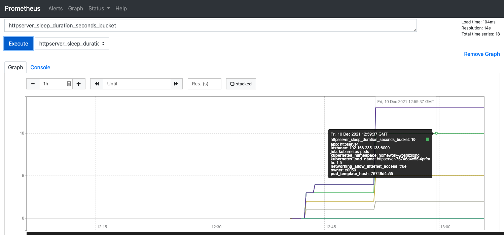
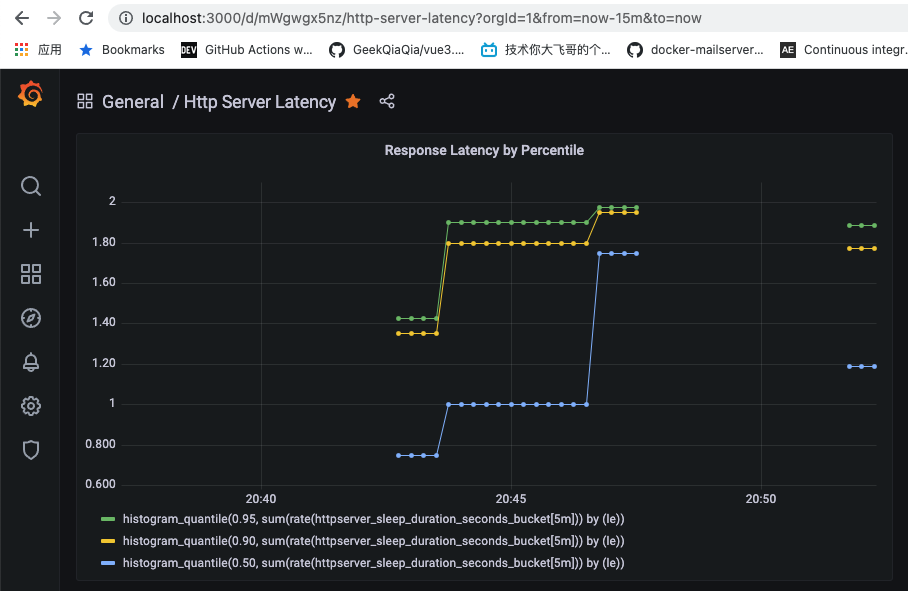

# homework4-module10

## 作业内容

- 为 HTTPServer 添加 0-2 秒的随机延时
- 为 HTTPServer 项目添加延时 Metric
- 将 HTTPServer 部署至测试集群，并完成 Prometheus 配置
- 从 Promethus 界面中查询延时指标数据
- （可选）创建一个 Grafana Dashboard 展现延时分配情况

作业提交链接： <https://jinshuju.net/f/z0Z07s>
提交截止时间：12 月 12 日（本周日） 23:59

## 完成情况

- [x] 为 HTTPServer 添加 0-2 秒的随机延时。
   参考 launcher.go > infoHandler
- [x] 为 HTTPServer 项目添加延时 Metric
   参考 metrics.go > RecordSleep 和 launcher.go > infoHandler
- [x] 将 HTTPServer 部署至测试集群，并完成 Prometheus 配置
   参考 [loki-stack部署说明](Loki-Stack.md)
   增加pod注解 **prometheus.io/scrape: "true"** 和 **prometheus.io/port: "8000"**
- [x] 从 Promethus 界面中查询延时指标数据

- [x] （可选）创建一个 Grafana Dashboard 展现延时分配情况
   参考文件夹 grafana-dashboard 下的 httpserver-latency.json

